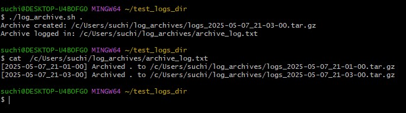

# Log Archive Tool

A command-line tool to archive logs by compressing them with date and time, storing them in a new directory. This helps keep your system clean by removing old logs while maintaining compressed archives for future reference.

---

## Reference

This project is a part of my hands-on DevOps learning, guided by the [DevOps Roadmap]
https://roadmap.sh/projects/server-stats

## Project Overview

This tool compresses logs from a specified directory on a set schedule and stores the compressed archive in a new directory. It is especially useful for managing log files on Unix-based systems, where logs are commonly stored in `/var/log`.

---

## Features

- Run from the command line.
- Accepts the log directory as an argument.
- Compresses logs into a `.tar.gz` archive.
- Stores archives in a new directory.
- Logs the date and time of each archive operation to a file.

---

## Usage

log-archive <log-directory>

Example:

log-archive /var/log

---

## Requirements

- The tool should accept the log directory as an argument when running, e.g., `log-archive <log-directory>`.
- Compress the logs into a `tar.gz` file.
- Store the compressed archive in a new directory.
- Log the date and time of the archive operation to a file.

---

## Benefits

- Keeps the system clean by archiving and compressing old logs.
- Maintains logs in compressed format for future reference.
- Helps practice programming skills including file and directory operations and building CLI tools.

---

## Notes

- The most common log directory on Unix-based systems is `/var/log`.
- The tool can be scheduled with cron or other schedulers for automated archiving.

---

## Example Archive Filename

logs_archive_YYYYMMDD_HHMMSS.tar.gz

---

## Screenshot

