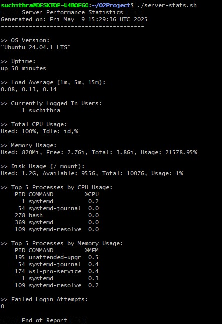

# Server Performance Statistics Script

## Overview

`server-stats.sh` is a simple and portable shell script to analyze key server performance metrics on any Linux machine. It provides insights into CPU, memory, and disk usage, as well as top resource-consuming processes and general system health stats.

---

## Features

- Total **CPU usage** (user, idle)
- Total **memory usage** (used vs free with percentage)
- Total **disk usage** on root (used vs available with percentage)
- **Top 5 processes** by CPU usage
- **Top 5 processes** by memory usage
- **OS version** :
- **Uptime** :
- **Load average** :
- **Logged-in users** :
- **Failed login attempts** :

---

## Screenshot

