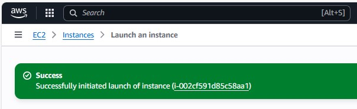
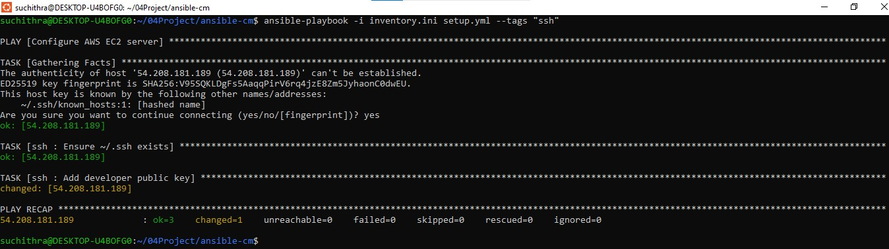
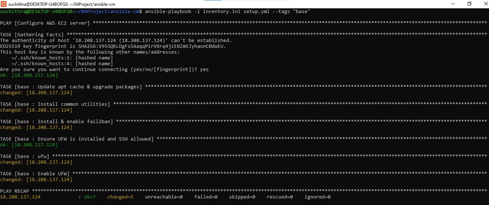
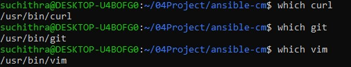
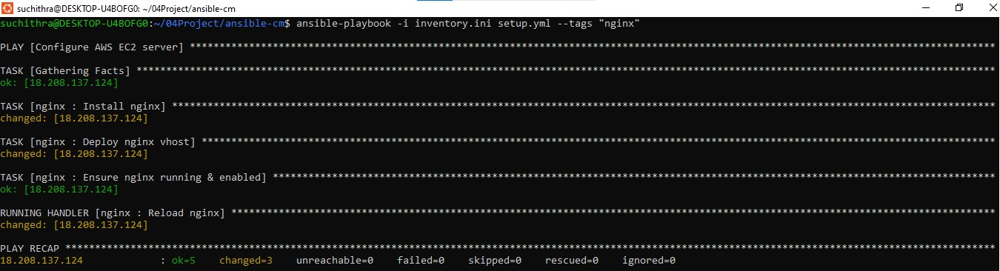
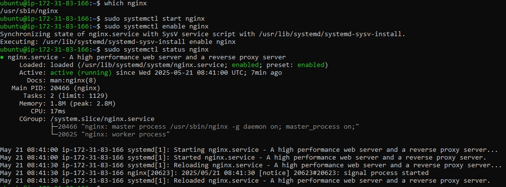
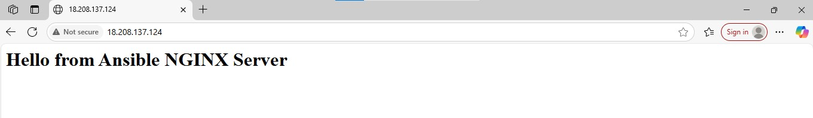
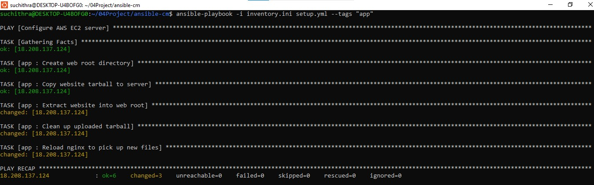
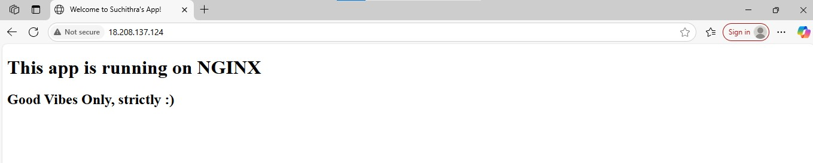

# Ansible Linux Server Configuration

Automate the configuration of a Linux server using Ansible. This project sets up a server with essential utilities, Nginx, a static HTML website, and SSH key access using modular Ansible roles.

## Features

- **Base**: Updates system, installs utilities, configures fail2ban
- **Nginx**: Installs and manages Nginx web server
- **App**: Deploys a static HTML website (from tarball )
- **SSH**: Adds a public SSH key for secure access

## Directory Structure

```text
ansible-cm/
├── inventory.ini                 # Inventory file with server details
├── setup.yml                    # Main playbook that runs all roles
└── roles/
    ├── base/                    # Base role: system updates & tools
    │   └── tasks/
    │       └── main.yml
    ├── nginx/                   # NGINX role: install & configure
    │   ├── tasks/
    │   │   └── main.yml
    │   ├── templates/
    │   │   └── default.conf.j2
    │   └── handlers/
    │       └── main.yml
    ├── app/                     # App role: deploy static site
    │   ├── tasks/
    │   │   └── main.yml
    │   └── files/
    │       └── website.tar.gz   # static site tarball
    └── ssh/                     # SSH role: manage public key access
        ├── tasks/
          └── main.yml
       
```
## Screenshots and Steps

### Step 1: Set up WSL (Windows Subsystem for Linux)

Download Ubuntu in local system and install ansible


### Step 2: Launch AWS EC2 Instance



### Step 3: Download `.pem` Key and SSH into EC2

```
 ssh -i ansible-key.pem ubuntu@54.158.161.237
```


### Step 4: Configure SSH Access with Ansible

Automating the addition of public SSH key so, login is password-free.

**SubSteps:**  
- Ensured `~/.ssh` directory exists  
- Added public key to `authorized_keys`  

**Execution:**  
```
ansible-playbook -i inventory.ini setup.yml --tags "ssh"
```


### Step 5: Base Role – System Update & Utilities

Perform system updates, installs utilities, common tools, configures fail2ban.

**SubSteps:** 
- Updates APT cache and upgrades packages
- Installs utilities: git, curl, unzip, htop, ufw
- Enables basic UFW rules for SSH

**Execution:**  
```
ansible-playbook -i inventory.ini setup.yml --tags "base"
```


**Verification:**  



### Step 6: NGINX Role – Web Server Setup

Install and configure NGINX to serve static content.

**SubSteps:** 
- Installs NGINX package
- Deploys a site config (default.conf)
- Enables and starts the service

**Execution:**  
```
ansible-playbook -i inventory.ini setup.yml --tags "nginx"
```


**Verification:**  

- systemctl status nginx shows active



- Default NGINX page



### Step 7: App Role – Deploy Static Website

Upload and extract website tarball into the NGINX root.

**SubSteps:** 
- Creates /var/www/html
- Copies website.tar.gz to /tmp
- Unarchives into /var/www/html
- Cleans up and reloads NGINX

**Execution:**  
```
ansible-playbook -i inventory.ini setup.yml --tags "app"
```


**Verification:**  

- Visit customized webpage


