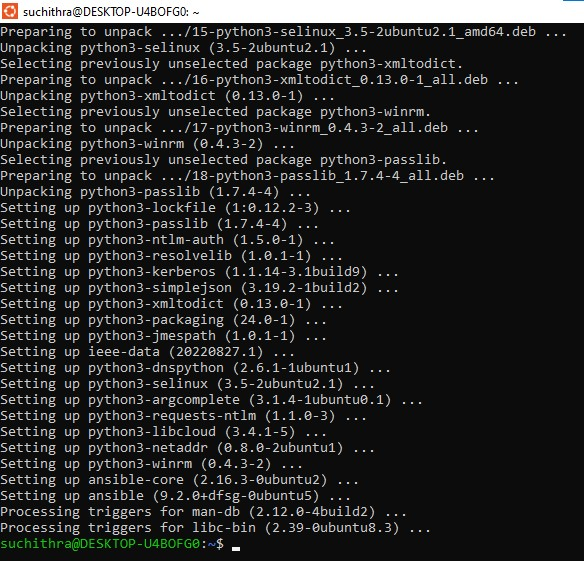
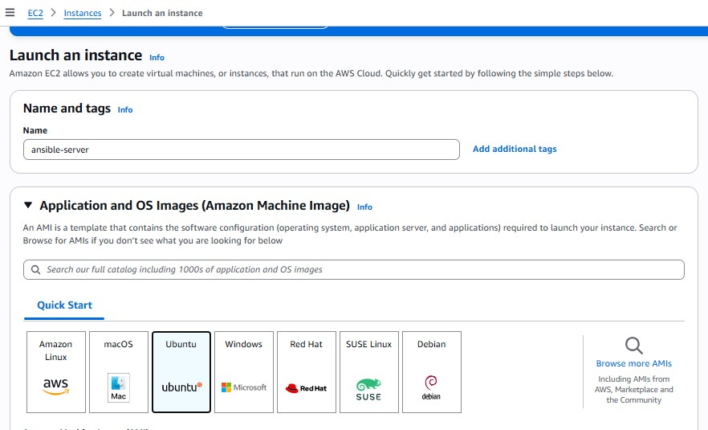
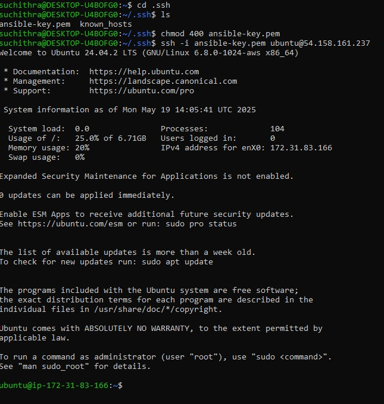

# Ansible Linux Server Configuration

Automate the configuration of a Linux server using Ansible. This project sets up a server with essential utilities, Nginx, a static HTML website, and SSH key access using modular Ansible roles.

## Features

- **Base**: Updates system, installs utilities, configures fail2ban
- **Nginx**: Installs and manages Nginx web server
- **App**: Deploys a static HTML website (from tarball or GitHub)
- **SSH**: Adds a public SSH key for secure access

## Directory Structure

```text
ansible-cm/
├── inventory.ini                 # Inventory file with server details
├── setup.yml                    # Main playbook that runs all roles
└── roles/
    ├── base/                    # Base role: system updates & tools
    │   └── tasks/
    │       └── main.yml
    ├── nginx/                   # NGINX role: install & configure
    │   ├── tasks/
    │   │   └── main.yml
    │   ├── templates/
    │   │   └── default.conf.j2
    │   └── handlers/
    │       └── main.yml
    ├── app/                     # App role: deploy static site
    │   ├── tasks/
    │   │   └── main.yml
    │   └── files/
    │       └── website.tar.gz   # static site tarball
    └── ssh/                     # SSH role: manage public key access
        ├── tasks/
        │   └── main.yml
        └── files/
            └── id_rsa.pub       # SSH public key

## Screenshots and Steps

### Step 1: Set up WSL (Windows Subsystem for Linux)

Download Ubuntu in local system and install ansible


### Step 2: Launch AWS EC2 Instance


### Step 3: Download `.pem` Key and SSH into EC2
```bash
 ssh -i ansible-key.pem ubuntu@54.158.161.237

