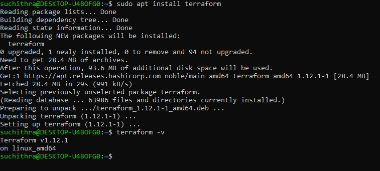
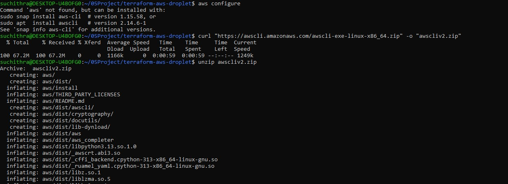
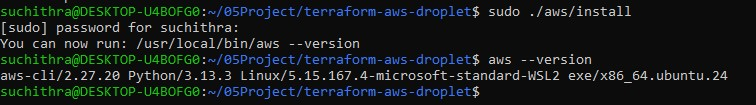
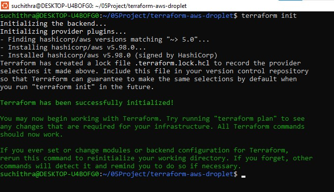
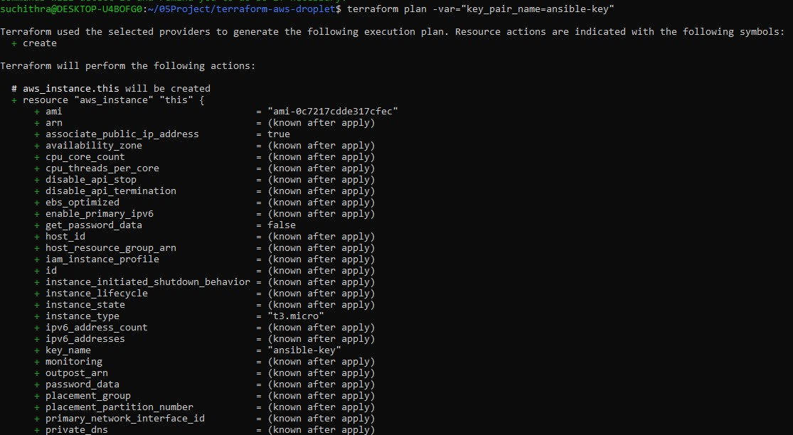
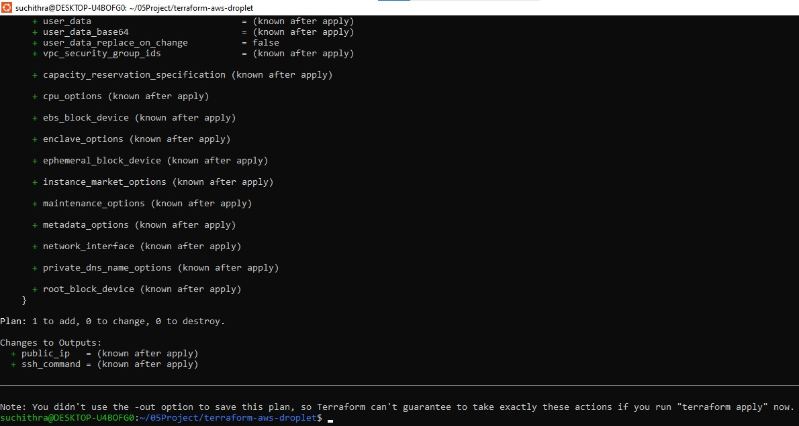
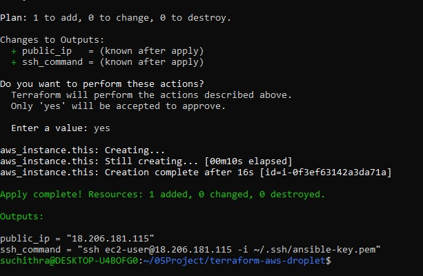
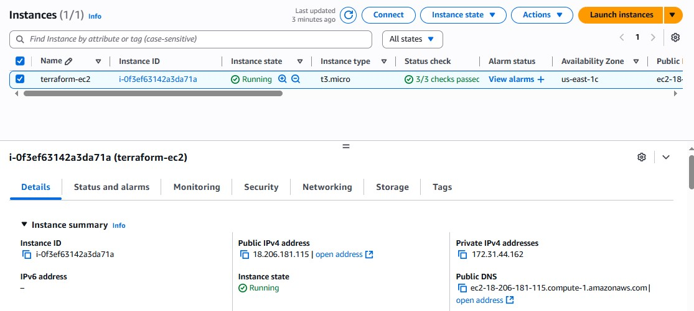

# Terraform AWS EC2 Instance 

## Project Overview

This project demonstrates the basics of Infrastructure as Code (IaC) using **Terraform** to provision an AWS EC2 instance.  
The EC2 instance is created with:  
- A **public IP address**  
- **SSH access** using a private key  
- The ability to SSH into the instance after deployment  

---

## Prerequisites

- An AWS account with appropriate permissions to create EC2 instances and key pairs  
- Terraform installed (version >= 1.0)  
- AWS CLI installed and configured (`aws configure`)  
- An existing AWS EC2 key pair, or a new one to be created  
- SSH client to connect to the instance (e.g., OpenSSH on Linux/WSL or PuTTY on Windows)  

---

## Project Structure

| Filename       | Description                           |
|----------------|-------------------------------------|
| `main.tf`      | Defines the AWS EC2 instance and resources |
| `variables.tf` | Declares input variables             |
| `outputs.tf`   | Defines outputs such as public IP and ssh command |
| `versions.tf`  | Specifies Terraform and provider versions |

---

## Steps and Screenshots

### 1. Downloading and Installing Terraform

### 2. Downloading and Installing AWS CLI

### 3. Configure the AWS credentials

     aws configure

Enter the AWS Access Key ID, Secret Access Key, region (e.g., us-east-1), and output format(JSON or can be ignored).

### 4. Update variables.tf as needed

Modify variables such as key_pair_name with the name of the AWS key pair(ansible-key, as used in the previous project).

### 5. Initialize Terraform

    terraform init
    

### 6. Preview the Terraform plan

    terraform plan -var="key_pair_name=ansible-key"

### 7. Apply the Terraform configuration

    terraform apply -var="key_pair_name=ansible-key"

Type yes when prompted.

## Usage
After terraform apply completes, Terraform outputs the public IP address and the SSH command to connect.

Example SSH command:

    ssh -i ~/.ssh/ansible-key.pem ubuntu@18.206.181.115

This command is used to log in and manage ec2 instance.

## Verify in AWS Console

- Log in to the AWS Management Console
- Navigate to EC2 -> Instances
- Find the instance by public IP
- Verify the instance state is running

