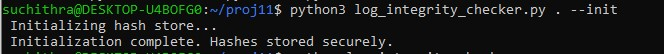
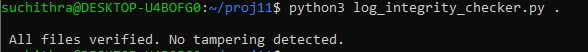

# Log File Integrity Checker

A Python-based tool that ensures the integrity of log files by detecting unauthorized tampering using cryptographic hashing

Ideal for security-conscious environments, DevOps pipelines, and compliance audits.

##  Features

-  Accepts a single log file or an entire directory of logs.
-  Uses SHA-256 to compute secure hashes.
-  Stores hashes securely on first use.
-  Compares new hashes with stored ones during subsequent runs.
-  Reports discrepancies that indicate tampering.
-  Supports manual re-initialization of hashes.
-  Simple CLI usage with optional flags.

## Directory strucure
```
log-integrity-checker/
├── log_integrity_checker.py
├── log_hashes.json      # Auto-generated
└── README.md
```

##  Installation

```
git clone https://github.com/suchithrachandrasekaran/log-integrity-checker.git
cd log-integrity-checker
```
### First-Time Initialization
    python log_integrity_checker.py /path/to/logs --init

###  Verify Log File Integrity
    python log_integrity_checker.py /path/to/logs

### Reinitialize Hashes (Manual Reset)
    python log_integrity_checker.py /path/to/logs --init

## Screenshot

### Initialisation



### File Verification




